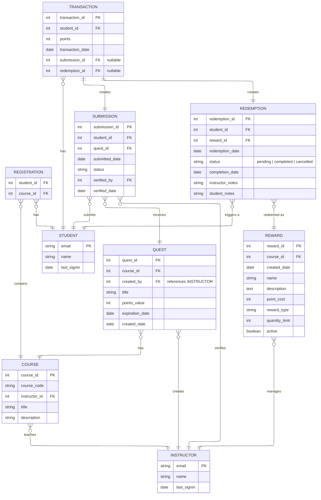

# LevelUpEDU
A gamified educational platform for web and mobile where students navigate a 2d RPG-like world and complete challenges to earn rewards.

## Quick Start

1. Clone the repo
2. Run the following commands:
```sh
pnpm install
pnpm dev
```
3. Navigate to: <https://localhost:8080/game>

## Project Structure
```
src/
├── app/             # Next.js App Router, API endpoints, pages
├── components/      # React / Phaser bridge and initialization wrapper
├── data/            # Tiled map JSON files
├── interactions/    # Interaction handlers for each possible interaction
├── scenes/          # Scene class (main game loop), and individual scenes
├── types/           # TypeScript interfaces
└── utils/           # InputHandler, physics helpers, sprite effects
```

## Adding Interactable Objects

1. Add sprite to manifest: `public/assets/sprites/{sceneName}/manifest.json`
2. Add sprite image to same folder: `public/assets/sprites/{sceneName}/{spriteName}.png`
3. In Tiled add the object to "Interactable" layer with these fields:
    - eventType: Name of interaction (e.g., "chalkboard")
    - active: true/false - whether interaction is enabled
    - displayName: Text label player sees
    - tooltip: Interaction prompt
    - passable: false if player can't walk through
    - pulseColor: Optional hex color for animation like "#ffffff"
4. Create file with interaction code in src/interactions/{name}.ts
5. Register the interaction by adding import in src/interactions/index.ts

## Business Rules

1. Transactions must reference exactly one submission, or redemption: 
`CHECK ((submission_id IS NOT NULL AND redemption_id IS NULL) OR (submission_id IS NULL AND redemption_id IS NOT NULL))`
2. Student points are not stored in student table to protect against data inconsistency (use a SUM instead)
## Database Schema
